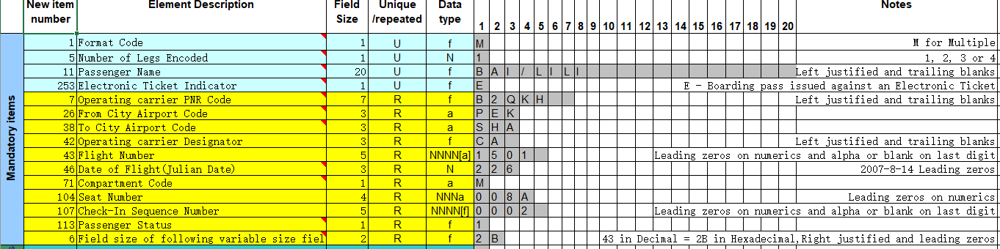

# Barcode Parser
In this barcode parser project we are going take a boarding pass barcoded text, and going to parse it in _**boarding pass's**_ fields .

>**For Example, Let's take a boarding pass barcoded text :-**  
>
: "M1XIE/ZAIPENG+++++++++EMYK8BR+PEKLAXCA+0987+208Y033J0063 +15D>5181O+0208BCA++++++++++++++2A999243176753702CA+CA+ 052002790109+++++2PCN*30600000K0901+++++++"

It's the boarding pass's barcoded text as a string which is containing different substrings with relevant information.

Like : 
* Format,  "M"
* Number of Legs,  "1"
* Passenger Name,  "XIE/ZAIPENG"
* E Ticket Indicator,  "E"
* PNR,  "MYK8BR"
and so on......

We can see here that we extracted Format firstly with length 1, and then Number of Legs with length 1 too.

>But, Why we are extracting with the help of length?

So we had got a fixed set of specification which is telling us about the field size of each boarding pass's field. 

Refer the image below for knowing the pre-defined specifications:

  
So in specifications we can see the passenger name has been assigned field size of 20 and in string we can see XIE/ZAIPENG as name followed by "+" sign, so this concept is called padding of string you can read about [padding](https://www.c-sharpcorner.com/UploadFile/mahesh/padding-strings-in-C-Sharp/) here, padding of string is ensuring that each field is consuming its defined length as per specifications.

So in string when we are seeing "+" sign we can understand that it is padding and we can just see blank spaces " " at the place of "+" sometimes.

## Diagrams Part 

1. Class Diagram

